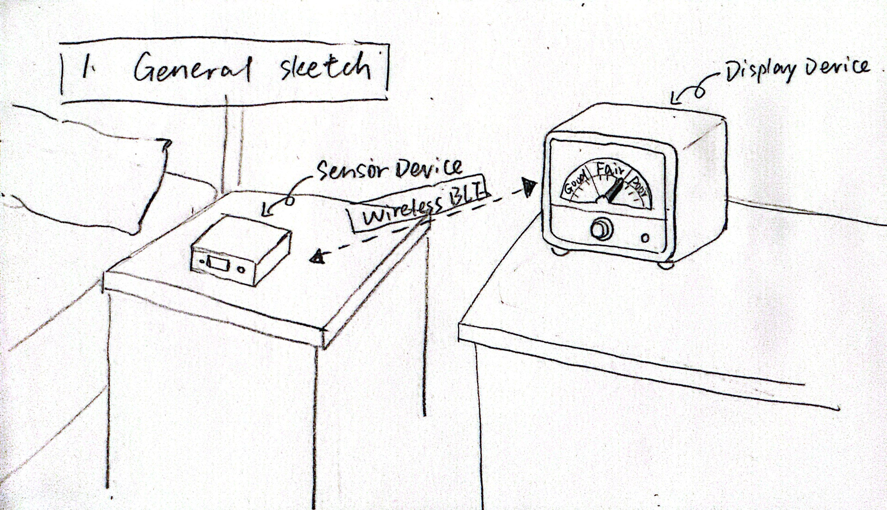
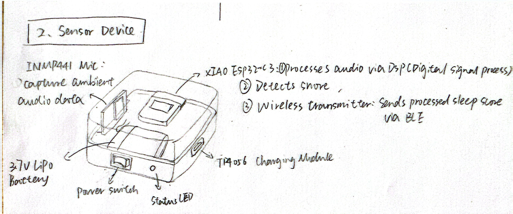
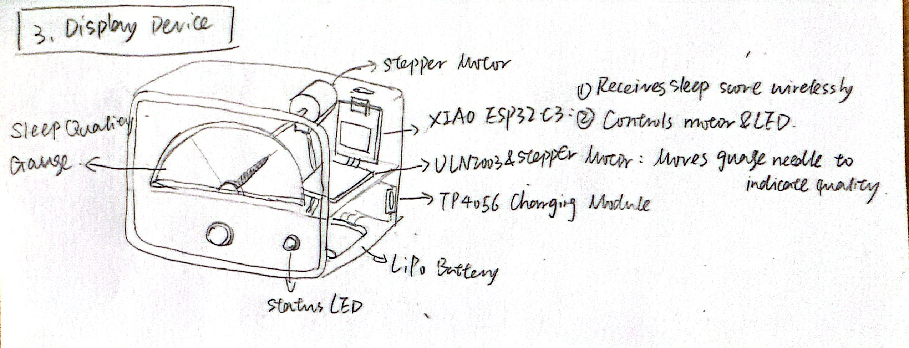

# SnoreSense – A Snoring-Based Sleep Quality Indicator

## Project Overview
SnoreSense is a connected sleep quality indicator designed to help users become aware of their sleep patterns through snoring detection. A sensing device placed near the bed detects and counts snoring events overnight using audio sensing and simple signal processing. The processed data is converted into a sleep quality score and transmitted wirelessly to a paired display device, which visualizes the score using a physical gauge interface.

## Sensor Device – Snoring Detection Unit
The sensing device is placed near the user’s bed and is responsible for detecting snoring activity during sleep. It uses a digital MEMS microphone (INMP441) to capture audio signals and an ESP32 microcontroller to process the data locally. Simple digital signal processing techniques are applied to detect and count snoring events overnight. The summarized results are then transmitted wirelessly to the display device.

**Key hardware components:**
- Microcontroller: Seeed Studio XIAO ESP32-C3
- Microphone: INMP441 Digital MEMS Microphone
- Power: 3.7V LiPo battery

The sensing device is designed for overnight operation and employs local processing and low-power wireless communication to reduce energy consumption.

## Display Device – Sleep Quality Gauge
The display device provides a physical and glanceable visualization of sleep quality data received from the sensing device. It uses a stepper-motor-driven gauge needle to represent sleep quality levels, allowing users to quickly understand their sleep performance. An LED provides a simple on/off indication of snoring activity. The device receives data wirelessly and updates the display accordingly.

**Key hardware components:**
- Microcontroller: Seeed Studio XIAO ESP32-C3
- Stepper Motor: 28BYJ-48 Stepper Motor with ULN2003 Driver
- LED: Standard 5mm LED
- Input: Tactile push button
- Power: Battery-powered (e.g. AA batteries or LiPo battery)

The stepper motor is only activated when the displayed value changes, minimizing power consumption.

## System Architecture & Communication Diagram
 

