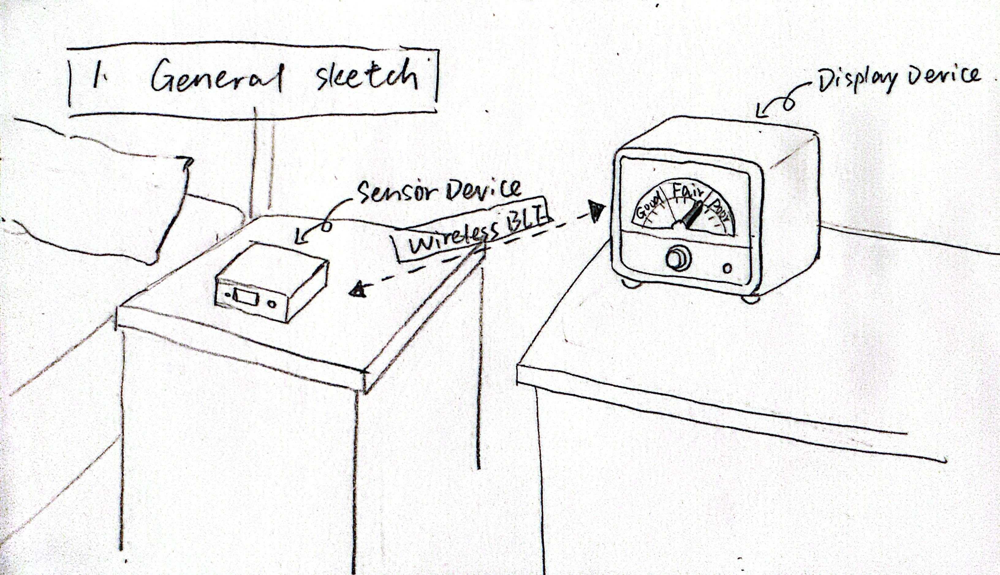
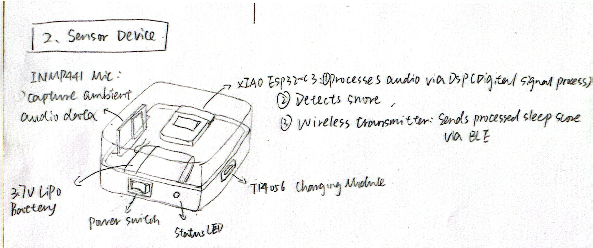
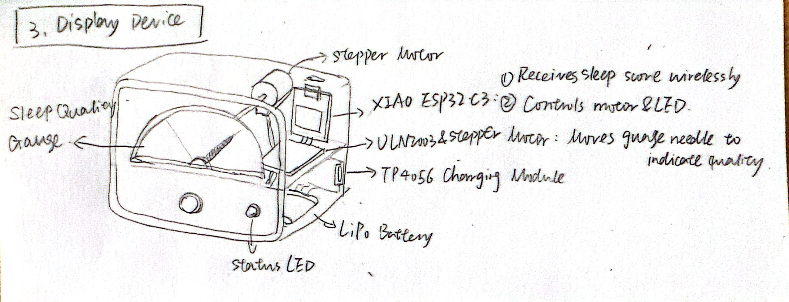
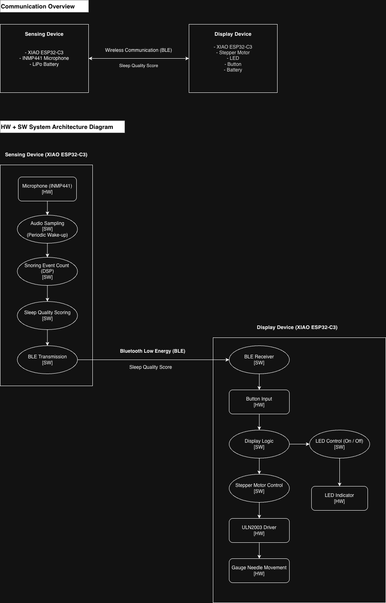

# SnoreSense – A Snoring-Based Sleep Quality Indicator

## Project Overview
SnoreSense is a connected sleep quality indicator designed to help users become aware of their sleep patterns through snoring detection. A sensing device placed near the bed detects and counts snoring events overnight using audio sensing and simple signal processing. The processed data is converted into a sleep quality score and transmitted wirelessly to a paired display device, which visualizes the score using a physical gauge interface.

## Demo Video
[) 

## Sensor Device – Snoring Detection Unit
The sensing device is placed near the user’s bed and is responsible for detecting snoring activity during sleep. It uses a digital MEMS microphone (INMP441) to capture audio signals and an ESP32 microcontroller to process the data locally. Simple digital signal processing techniques are applied to detect and count snoring events overnight. The summarized results are then transmitted wirelessly to the display device.

**Key hardware components:**

Microcontroller: Seeed Studio XIAO ESP32-C3

Microphone: INMP441 (Part No. 441NP0552) Digital MEMS Microphone

Power: 3.7V 1000mAh LiPo battery

Charging Module: TP4056 Lithium Battery Charger Module

Power Management: SPST Slide Switch for physical battery isolation

Logic: Timed Wake-up strategy (1Hz duty cycle) – The system samples audio for 200ms every second and remains in Deep Sleep for the remaining 800ms.

The device is designed for fully automated operation. The LED serves as a transient event indicator (5% duty cycle), blinking only when a potential snore is detected or during brief wireless data syncs via ESP-NOW.

**The Scoring Metric** 

1. Total Snore Count: Every 1-second interval that hits the threshold.

2. Bout Count: How many times the user started snoring after at least 2 minutes of silence.

*Logic Criteria (Example for 8hrs)* 
- Good: Minimalsnoring,< 50 total snores AND < 3 Bouts
- Fair: Occasional,snoring,50–200 total snores OR 3–10 Bouts
- Poor: Frequent/Heavy snoring,> 200 total snores OR > 10 Bouts

## Display Device – Sleep Quality Gauge
The display device provides a physical and glanceable visualization of sleep quality data received from the sensing device. It uses a stepper-motor-driven gauge needle to represent sleep quality levels, allowing users to quickly understand their sleep performance.It provides a physical and glanceable visualization of sleep quality data. It features a custom-designed PCB that integrates a high-precision automotive-grade stepper motor and user interaction components.An LED provides a simple on/off indication of snoring activity. The device receives data wirelessly and updates the display accordingly.  

**Key hardware components:**

Microcontroller: Seeed Studio XIAO ESP32-C3 (U1) 

Stepper Motor: Juken X27.168 Stepper Motor (Direct Drive via GPIO)

Indication: Standard 5mm LED (D1) + 220Ω Resistor (R1)

User Input: 6x6mm Tactile push button (SW1) with 10kΩ pull-up resistor (R2) 

Power Solution: 3.7V LiPo battery via JST-PH 2-pin connector (J2)

Power Management: SPST Slide Switch (Master Power) to ensure zero parasitic drain when not in use. 

Circuit Stability: 0.1µF (C1) and 10µF (C2) ceramic capacitors for decoupling and voltage stability. 

The X27 stepper motor is only energized when the sleep quality score changes. The Push Button (SW1) allows the user to manually trigger a gauge calibration (homing) or wake the device from deep sleep.

## System Architecture & Communication Diagram
 

